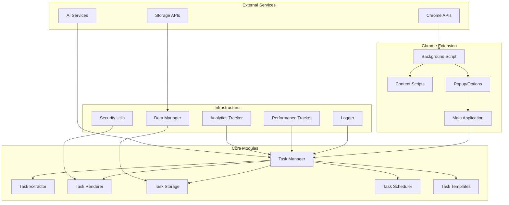
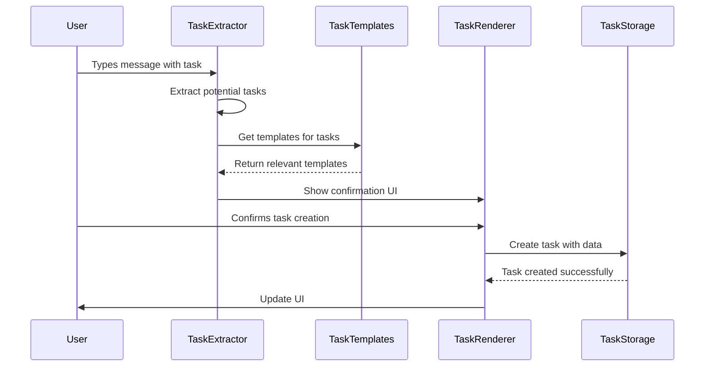
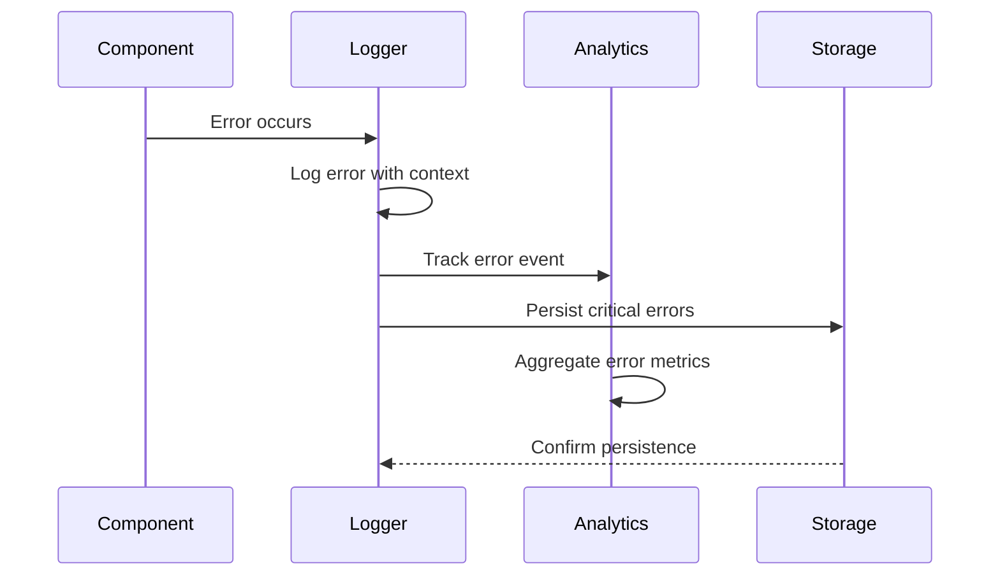

# Branestawm Architecture Documentation

## Overview

Branestawm follows a **modular, event-driven architecture** designed for maintainability, security, and performance. The extension is built as a Chrome Manifest V3 extension with a focus on neurodivergent user support.

## High-Level Architecture



## Core Components

### 1. Task Management System

#### TaskManager (Coordinator)
```javascript
class TaskManager {
    constructor(dataManager) {
        this.extractor = new TaskExtractor();
        this.templates = new TaskTemplates();
        this.storage = new TaskStorage(dataManager);
        this.scheduler = new TaskScheduler(dataManager);
        this.renderer = new TaskRenderer();
    }
}
```

**Responsibilities:**
- Coordinate between all task-related modules
- Handle high-level task operations
- Manage event dispatching and UI updates

#### TaskExtractor
```javascript
class TaskExtractor {
    extractPotentialTasks(messageContent);
    categorizeTask(taskText, context);
    calculateTaskConfidence(text);
}
```

**Responsibilities:**
- Parse text for potential tasks using regex patterns
- Categorize tasks (work, personal, creative, administrative)
- Calculate confidence scores for extracted tasks

#### TaskRenderer
```javascript
class TaskRenderer {
    createTaskConfirmationUI(tasks, extractor);
    renderTaskTimeline(tasks, containerId);
    scrollToAndHighlightTask(taskId);
}
```

**Responsibilities:**
- Generate secure HTML for task interfaces
- Handle UI interactions and animations
- Manage DOM manipulation safely

#### TaskStorage
```javascript
class TaskStorage {
    async createTask(taskData);
    async updateTask(taskId, updates);
    getTasksBy(filters);
    getTaskStatistics();
}
```

**Responsibilities:**
- Persist task data to Chrome storage
- Provide CRUD operations for tasks
- Generate task statistics and reports

#### TaskScheduler
```javascript
class TaskScheduler {
    async startTaskTimer(taskId);
    async pauseTaskTimer(taskId);
    async resumeTaskTimer(taskId);
    parseTimeEstimate(timeString);
}
```

**Responsibilities:**
- Handle time tracking for tasks
- Manage pause/resume functionality
- Parse and validate time estimates

#### TaskTemplates
```javascript
class TaskTemplates {
    detectTaskTemplates(taskText, context);
    findRelatedTasks(taskText, category);
    calculateTemplateRelevance(template, text);
}
```

**Responsibilities:**
- Generate smart task templates based on content
- Suggest related tasks and breakdowns
- Calculate template relevance scores

### 2. Infrastructure Layer

#### Logger
```javascript
class Logger {
    error(message, data);
    warn(message, data);
    info(message, data);
    debug(message, data);
    performance(operation, duration, data);
}
```

**Features:**
- Configurable log levels (error, warn, info, debug)
- Production vs development mode detection
- Persistent error storage for debugging
- Performance timing integration

#### SecurityUtils
```javascript
class SecurityUtils {
    static escapeHtml(text);
    static sanitizeCssValue(value);
    static validateDataAttribute(value);
    static isSafeUrl(url);
}
```

**Features:**
- XSS prevention through HTML escaping
- CSS injection protection
- URL validation for safe links
- Input sanitization utilities

#### PerformanceTracker
```javascript
class PerformanceTracker {
    start(operationName);
    end(timerId, metadata);
    timeFunction(operationName, fn, ...args);
    getSummary();
}
```

**Features:**
- Operation timing with memory tracking
- Threshold monitoring and alerting
- Automatic Chrome API wrapping
- Memory leak detection

#### AnalyticsTracker
```javascript
class AnalyticsTracker {
    trackEvent(eventName, properties, category);
    trackError(error, context, severity);
    trackTaskMetrics(action, taskData);
    getSummary();
}
```

**Features:**
- Privacy-first analytics with user consent
- Task completion rate tracking
- Feature usage insights
- Error aggregation and reporting

## Data Flow

### Task Creation Flow


### Error Handling Flow


## Security Architecture

### XSS Prevention
```javascript
// Always escape user input
const safeHtml = SecurityUtils.escapeHtml(userInput);
element.innerHTML = `<div>${safeHtml}</div>`;

// Use safe template literals
const template = SecurityUtils.safeHtml`<span>${userInput}</span>`;
```

### Content Security Policy
```json
{
  "content_security_policy": {
    "extension_pages": "script-src 'self'; object-src 'self'"
  }
}
```

### Permission Model
- **Minimal permissions**: Only request necessary Chrome APIs
- **Host permissions**: Limited to specific domains
- **Storage**: Local storage with optional encryption
- **Identity**: OAuth2 for secure authentication

## Performance Considerations

### Memory Management
- **Weak references** for event listeners
- **Object pooling** for frequently created objects
- **Lazy loading** for non-critical components
- **Garbage collection** monitoring

### Bundle Optimization
```javascript
// Tree shaking friendly exports
export { TaskManager } from './task-manager';
export { TaskExtractor } from './task-extractor';

// Dynamic imports for large modules
const analytics = await import('./analytics-tracker');
```

### Chrome Extension Specific
- **Background script**: Service worker with minimal memory footprint
- **Content scripts**: Injected only when needed
- **Popup**: Lightweight and fast-loading
- **Options page**: Lazy-loaded settings interface

## Testing Strategy

### Unit Tests
```javascript
test('should extract tasks from message', () => {
    const extractor = new TaskExtractor();
    const result = extractor.extractPotentialTasks('I need to call John');
    
    expect(result.length).toBe(1);
    expect(result[0].text).toBe('Call John');
    expect(result[0].category).toBe('work');
});
```

### Integration Tests
```javascript
test('should create task end-to-end', async () => {
    const manager = new TaskManager(mockDataManager);
    await manager.processMessage('I need to finish the report');
    
    const tasks = manager.getAllTasks();
    expect(tasks.length).toBe(1);
    expect(tasks[0].title).toBe('Finish the report');
});
```

### Performance Tests
```javascript
test('should extract tasks within performance threshold', () => {
    const timerId = perf.start('task_extraction');
    extractor.extractPotentialTasks(longMessage);
    const result = perf.end(timerId);
    
    expect(result.duration).toBeLessThan(100); // 100ms threshold
});
```

## Deployment Architecture

### CI/CD Pipeline
1. **Lint & Quality**: Code quality checks and security scanning
2. **Test**: Unit and integration test execution
3. **Build**: Minification, bundling, and optimization
4. **Package**: Chrome extension ZIP creation
5. **Deploy**: Chrome Web Store publication (on release)

### Environment Configuration
```javascript
const config = {
    development: {
        logLevel: 'debug',
        performanceTracking: true,
        analyticsEnabled: false
    },
    production: {
        logLevel: 'warn',
        performanceTracking: false,
        analyticsEnabled: true // with user consent
    }
};
```

## Extensibility

### Plugin Architecture
```javascript
class PluginManager {
    registerPlugin(name, plugin) {
        this.plugins.set(name, plugin);
    }
    
    async executeHook(hookName, ...args) {
        for (const plugin of this.plugins.values()) {
            if (plugin[hookName]) {
                await plugin[hookName](...args);
            }
        }
    }
}
```

### Event System
```javascript
// Custom events for loose coupling
document.dispatchEvent(new CustomEvent('taskCreated', {
    detail: { taskId, task }
}));

// Event listeners in components
document.addEventListener('taskCreated', (event) => {
    this.handleTaskCreation(event.detail);
});
```

## Future Architecture Considerations

### Microservices Migration
- Split large modules into smaller, focused services
- Use message passing for inter-service communication
- Implement circuit breakers for resilience

### TypeScript Migration
- Gradual conversion starting with core modules
- Strong typing for better maintainability
- Interface definitions for all major components

### Offline Support
- Service worker for offline functionality
- Local cache with sync capabilities
- Conflict resolution for offline changes

---

This architecture provides a solid foundation for the Branestawm extension while remaining flexible for future enhancements and scaling needs.